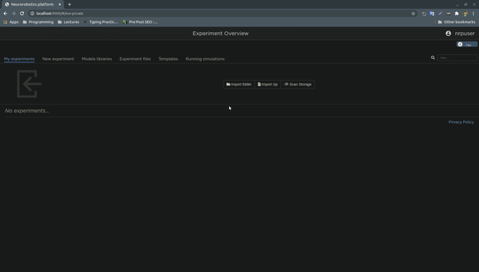

# Installation PANDA Simulation for the NRP

## Script(Automatic) installation.
`chmod +x install.sh `  
`./install.sh `  

## Manual installation.
Please install following ros-melodic packages with their version number. 
`sudo apt-get install ros-melodic-franka-ros=0.6.0-1bionic.20200930.133157` 
`sudo apt-get install ros-melodic-libfranka=0.8.0-1bionic.20200801.024519`  

- Copy the folder from `Panda_NRP/ROS_Packages/Models/panda` to inside the `$HBP/Models`  
- Copy all the folders from `Panda_NRP/ROS_Packages/src` to inside the `$HBP/GazeboRosPackages/src/`  
- Copy the folder from `Panda_NRP/nrpStorage/panda_experiment` to inside the `/.opt/nrpStorage`  

- Then, open terminal and go the the GazeboRosPackages folder  
`cd $HBP/GazeboRosPackages` 
then install all dependencies for panda_simulation package by typing the following code  
`rosdep install panda_simulation`  
- To create symlinks both in ~/.gazebo/models (for Gazebo) and ${HBP}/gzweb/http/client/assets (for the web). Please run the following code in the terminal. 
`$HBP/Models/create-symlinks.sh`

Finally, you can compile the workspace by typing  
`catkin_make` 

### you can import the model by clicking "Scan Storage" under "My Experiment" section :  

### you can start the model by clicking launch button.  

